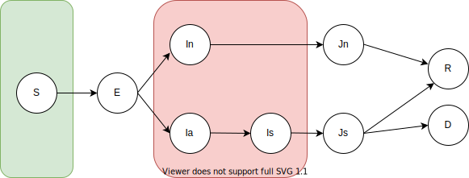

# MODEL SPECIFICATION

For full model description please refer to the preprint:

**Model-M: An agent-based epidemic model of a middle-sized municipality**<br>
Ludek Berec, Tomas Diviak, Ales Kubena, Rene Levinsky, Roman Neruda, Gabriela Suchoparova, Josef Slerka, Martin Smid,
Jan Trnka, Vit Tucek, Petra Vidnerova, Milan Zajicek, Frantisek Zapletal<br>
medRxiv 2021.05.13.21257139; doi: https://doi.org/10.1101/2021.05.13.21257139

Specification of the most important points of the model follows. (It requires to have a rough idea about the whole
model.)


# Base model

### States

+ set of states: S, E, I_n, I_a, I_s, J_n, J_s, R, D (+ EXT)

|state code|meaning| 
|---|---|
|S|*susceptible*, healthy individual| 
|E|*exposed*, infected but not infectious yet| 
|I_n|*infectious*, but asymptomatic (*no symptoms*)| 
|I_a|*infectious*, presymptomatic phase| 
|I_s|*infectious, symptomatic*|
|J_n|still positive, but already not infectious, asymptomatic| 
|J_s|still positive, but already not infectious, symptomatic| 
|R|*recovered*| 
|D|*dead*| 
||| 
|EXT|external node, auxiliary state|

+ each node has a flag if it was detected or not

### State transitions



+ S -> E happens after infectious contact, depends on contact graph and model parameter *beta* (*beta* specified
  in [INI FILE](inifile.md))
+ other transitions happen after the time assigned to stay in given state passes (times are generated based on
  probabilities specified in *durations_file*, see [INI FILE](inifile.md))
+ a decission to take symptomatic or asymptomatic path is made based on *asymptomatic_rate* (see [INI_FILE](inifile.md))
+ a decision to recover or die is made base on *prob_death_file* (see [INI_FILE](inifile.md))

# Contact graph

short paragraph about meaning of node, edge, probability of edge, intesity of edge, etc.

The contact graph is a multi-graph **V = (N, E)**, where **N** is a set of nodes and **E** is a set of edges. An edge
represents a possible contact between the two nodes. There can be multiple edges for each tuple **(u, v)**.

An edge is defined by **(u, v, t, p, i)**, where **u** and **v** are the nodes connected by an edge, **t** contains an
edge type, **p** is a probability of a contact and **i** is an intesity of this contact.

There are several types of edges, each type has its weight.

Each day, an edge is active (its contact is realized) with the probability **w_t * p**, where **w_t** is a weight of the
layer **t**. If an edge is active and one of its nodes is infectious and the second in the state S, the second node is
infected (changes its state to E) with the probability **i * beta**

The contact graph can be modified by a policy module (typically when contacts are reduced or a node is isolated or
quarantined).

# Policy module

Policy module is called after each day. It can modify the parameters of the model or modify the graph. Advanced users
can write their own policy, but for basic usage we recommend to use the standard policy:

```
[POLICY]
filename = customised_policy
name = CustomPolicy
```

The configuration is defined in [POLICY_SETUP](policy.md#custom-policy) section of INI file.

This policy also runs sub-policies, which can be [self-isolation](policy.md#self-isolation)
, [testing](policy.md#testing) or [contact-tracing](policy.md#contact-tracing).

Self-isolation is responsible for isolating a portion of individuals that exhibit symptoms. The *testing* policy is
responsible for testing, and the *contact-tracing* policy enhances it by contact tracing, both of them put the nodes to
isolation and quaratine. Details and exact algorithms can be found in
the [preprint](https://doi.org/10.1101/2021.05.13.21257139).
